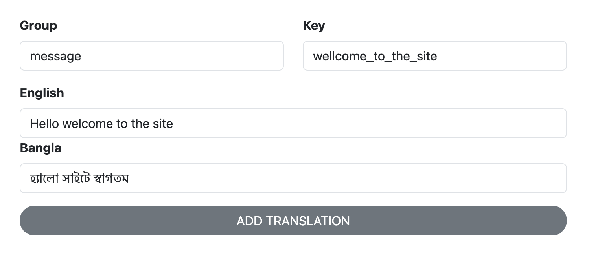

# TranslaFlex

Effortlessly translate your Laravel application.

#### composer.json

```
"repositories": [
    {
        "type": "vcs",
        "url": "https://github.com/jfBiswajit/translaflex"
    }
]

```

#### Install

`composer require jfBiswajit/translaflex`

#### Publish

`php artisan translaflex:publish`

#### Migrate

`php artisan migrate`

#### Create Translation
`yourdomain.com/translaflex/create`



#### Usages
`__('message.wellcome_to_the_site')`

#### Result

